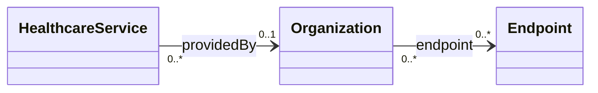

### Registry

All participating organizations — both Placers and Fulfillers — are registered in a shared **UMZH-Connect Registry**, inspired by [IHE mCSD (Mobile Care Services Discovery)](https://profiles.ihe.net/ITI/mCSD/volume-1.html#14641-concepts). The registry serves as a directory for discovering participating organizations, the services they offer, and their FHIR API endpoints.

The registry comprises three interrelated resource types:

- **Organization** — a participating healthcare provider (Placer or Fulfiller)
- **Endpoint** — the FHIR REST API endpoint of an organization, linked via `Organization.endpoint`
- **HealthcareService** — a specific service offered by an organization, linked to the organization via `HealthcareService.providedBy`

Because the registry is a shared, cross-organizational system, all references to registry-hosted resources must use absolute URLs (e.g. `http://registry.example.org/fhir/Organization/Fulfiller`). Consequently, any reference to a registry-hosted Organization must use an absolute URL — for example `Task.owner`, `Task.requester`, and `PractitionerRole.organization` (e.g. as used in `ServiceRequest.requester`) — rather than pointing to the local FHIR server of the Placer or Fulfiller.
