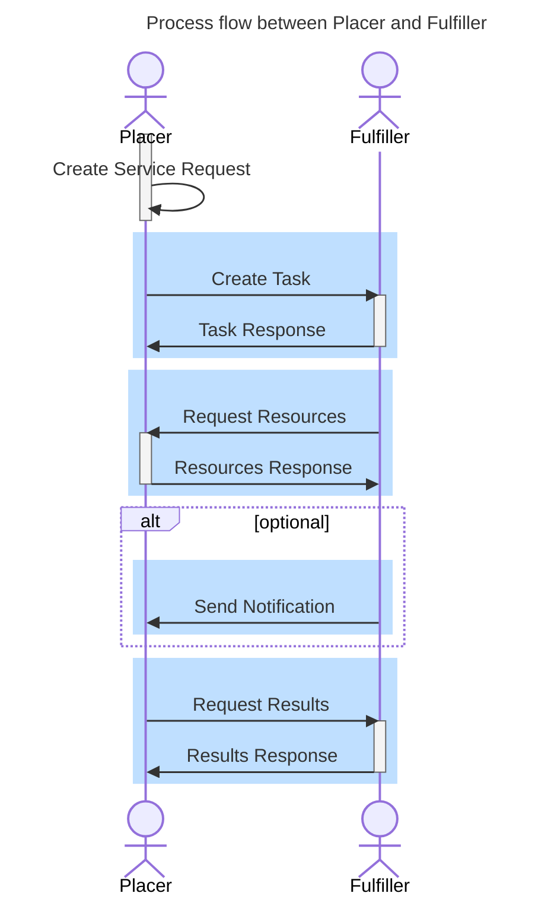

### Workflow oriented API design

This implementation guide is based on the core principles of [Clinical Order Workflow IG](https://hl7.org/fhir/uv/cow/2025May/core-concepts.html) with a focus on the [Task at Fulfiller](https://hl7.org/fhir/uv/cow/2025May/fulfiller-determination.html#task-at-fulfiller).

The COW (clinical order workflow) focuses on making clinical data available by API to relevant actors and notifying the partners about task in contrast to sending the bundled data to the partner in commonly used 'fire-and-forget' mode.

The COW refers to the requestor, referrer, and prescriber as the [**Placer**](ActorDefinition-ch-umzh-connect-placer.html) - the party who initiates the task, and the performer as the [**Fulfiller**](ActorDefinition-ch-umzh-connect-fulfiller.html) - the party that performs the requested service.
The **CoordinationTask** (resourceType Task) serves as the central element and business object, linking resources - inputs and outputs - between the participating parties and managing workflow patterns (i.e. states etc.).

The placer and filler provide their FHIR API endpoints to each other. Each organization is registered in a shared registry — see [Registry](core-concept-registry.html). External URLs for the organizations and resources referencing the other FHIR API must be absolute (see [partially closed, inter-linked systems](https://hl7.org/fhir/managing.html#using)).

The essentials of the **Task at Fulfillers** are illustrated in the following example:

**Example Workflow**

- The **referring provider (Placer)** creates a Service Request in their own environment, referencing additional information (patient demographics, medication, medical history, etc.).
- A minimal **Task** is created at the **receiving provider (Fulfiller)**, referencing the Service Request and establishing the workflow context for authorization.
- The Fulfiller gains access to restricted datasets from the Placer and can process the order further.
- The **Task** acts as the shared data object, linking datasets on both the Placer and Fulfiller sides and regulating access.
- The Fulfiller can add **references to results** (appointments, reports, etc.) in the Task, enabling the Placer to access results digitally.
- If needed, the data contract can be extended with a **notification instruction** to enable seamless integration.

The Task can be mutated by the Placer only via PATCH (RFC 6902, `application/json-patch+json`), and only when `Task.owner` references the Placer organization. The Placer may patch only the fields `owner`, `businessStatus`, `input`, and `focus`. See [Workflow States](workflow-states.html) for the state transitions in which this applies.
