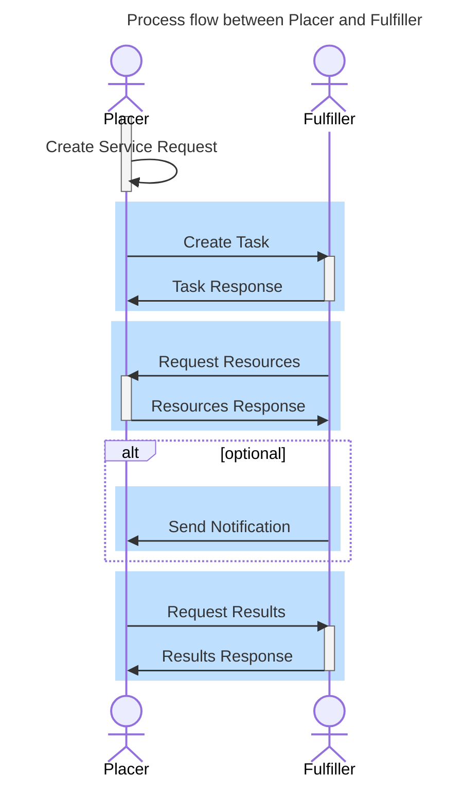

### Core concepts

The UMZH-connect project aims to improve digital connectivity for referrals and external orders (e.g. lab orders) between healthcare providers in the Zurich area, particularly the university hospitals. The system is designed to be extensible — both in terms of use cases and participating organizations.

### Workflow oriented API design

This implementation guide is based on the core principles of [Clinical Order Workflow IG](http://hl7.org/fhir/uv/cow/ImplementationGuide/hl7.fhir.uv.cow) with a focus on the [Task at Fulfiller](https://build.fhir.org/ig/HL7/fhir-cow-ig/en/fulfiller-determination.html#task-at-fulfiller).

The COW (clinical order workflow) focues on making clinical data available by API to relevant actors and notifying the partners about task in contrast to sending the bundled data to the partner in commonly used 'fire-and-forget' mode.

The COW refers to the requestor, referrer, and prescriber as the **Placer** - the party who initiates the task, and the performer as the **Fulfiller** - the party the performs the requested service.
As central element and business onject (also a FHIR resource) serves the **CoordinationTask** (resourceType Task) which links resources - inputs and outputs - between the participating parties and manages workflow patterns (i.e. states etc.)

The essentials of the **Task at Fulfillers** are illustrated in the following example:

**Example Workflow**

- The **referring provider (Placer)** creates a Service Request in their own environment, referencing additional information (patient demographics, medication, medical history, etc.).
- A minimal **Task** is created at the **receiving provider (Fulfiller)**, referencing the Service Request and including authorization information (Consent).
- The Fulfiller gains access to restricted datasets from the Placer and can process the order further.
- The **Task** acts as the shared data object, linking datasets on both the Placer and Fulfiller sides and regulating access.
- The Fulfiller can add **references to results** (appointments, reports, etc.) in the Task, enabling the Placer to access results digitally.
- If needed, the data contract can be extended with a **notification instruction** to enable seamless integration.

