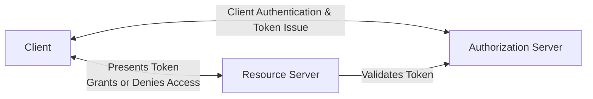
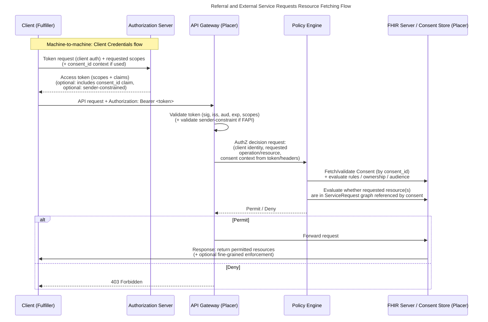
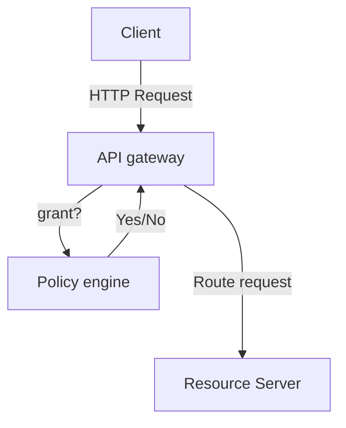

In this article:

- [Introduction](#introduction)
- [Genaral approach - OAuth](#general-approach---oauth)
- [Health specifics - SMARTonFHIR](#health-specifics---smartonfhir)
- [Consent-centric authorization](#consent-centric-authorization)
- [Authorization enforcement](#authorization-enforcement)
- [Security enhancement](#security-enhancement)

### Introduction

In this article we address security, authorization, and trust frameworks suitable for an open yet controlled healthcare API ecosystem. Out of the perspective of our pilot-project with two participants exposing data to each other through open but secured APIs, we show a hands on guide how each participant can/must secure his APIs based on industry standards, and examine how these approaches are expandable as ecosystems grows in terms of participants, software vendors, and regulatory expectations.

The use case considered is one where the placer creates a task at the fulfiller referencing a service request on placer’s side, the fulfiller based on the task proceeds to fetch the corresponding service request, and proceeds with an API based to query and fetch further resources referenced.

OAuth 2.0 and OpenID Connect–based architectures are the de-facto standard today for securing APIs, Security profiles such as SMART on FHIR define standards for health-specific use-cases and the OpenID Foundation’s FAPI 2.0 sharpens security awareness by enforcing measures to mitigate particular risk scenarios. In this article we explore to what extent theses standards are applicable for our problem and where additional measures may be suitable.

Special attention is given to machine-to-machine interactions, which are central to referral and order workflows, and to design decisions around client authentication, including private key–based mechanisms, mutual TLS (mTLS), and layered combinations of both. The concept however should be extensible to user/human centric authentication and authorization and particularly compatible with the future E-ID initiative, identifying Swiss registered users.

### General approach - OAuth

Todays de-facto standard for securing Web-APIs is **OAuth & OpenIDConnect**. In general OAuth is quite loosely defined and allows various ways of implementation. On a very high-level you could think of it like the following:

> *An application (possibly in combination with a logged in user) would like to access data from an external service. It therefore requests a security token from an authorization authority by providing credentials and uses this token in the request to the data service to provide proof of access rights and hence being allowed to access the data.*

**We follow industry standards with the use of OAuth/OIDC to segregate duties between identity management, token issuance, authentication & authorization enforcement.**

**OAuth glossary**

**Authorization Server (AS) -** The system that issues tokens after validating identity, credentials, or policies.
**Resource Server (RS) -** The API or service that receives and validates tokens before granting access.
**Client -** The application requesting access on behalf of a user or system.
**Access Token -** A short‑lived credential the client uses to call APIs.
**Scopes -** Fine‑grained permissions describing what the client is allowed to access.
**Claims -** Attributes embedded in a token (e.g., user ID, roles, tenant, expiry).
**Client Authentication -** How a client proves its identity to the authorization server (e.g., client secret, mTLS, private key JWT).
**Grant Type -** The method a client uses to obtain tokens (e.g., Authorization Code, Client Credentials).
**Policy engine** - system that evaluates rules (“policies”) to decide whether a specific action is allowed

**Machine-To-Machine communication**

Our principal focus will be on machine-to-machine communication: an organization allowing access to a set of data records to another organization without knowing which person is actually sending the request. It is likely that in later scenarios this option should also be considered an can be achieved by using alternative OAuth flows.

The **client-credentials OAuth flow** is the common way to approach this, where the client presents credentials and information about the action is it about to execute (scopes) to the resource server and in exchange receives an **access token.**

The access token again the client injects in the request to the **resource server** (the organization holding the sensitive patient data) and the latter can validate the token and grant or deny access.

### Health specifics - SMARTonFHIR

SMART on FHIR defines a **standard way for apps to securely connect to healthcare data** by combining:

- **OAuth 2.0–based authorization**
- **FHIR as the data API**
- **A consistent launch protocol** for apps inside or outside an EHR
- **A unified way to request permissions** using SMART scopes (i.e. **system/Patient.r** - read patient data etc..)

In practice, it gives app developers a predictable, interoperable method to authenticate, obtain tokens, and read/write clinical data across different EHR systems without custom integrations.

In our particular case we use SMART in the context of our use cases, for example:

- Ask permission to create a task resource at partyX - scope: system/Task.w
- Ask permission to read service request data from partyY - scope: system/ServiceRequest.rs

### Consent-centric authorization

Our use-cases of referrals and external service requests strongly suggest to dynamically authorize the audience (the counter party) to a very limited data set. Think of creating a consent when the service request is created:

> *For a given time I authorize partyB (represented by clientX) to read all data referenced by my given service request.*

This consent stands in contrast to commonly used ‘general consent’ by a patient for data usage in research. In our case the consent defines either a rule based or explicit set of resources which the counter party is authorized to access.

A consent with appropriate properties is typically stored at the consent issuers location, treated as a resource itself and receiving a unique identification at time of creation. This identification is commonly communicated to the counter party in combination with the given case an optionally made available to the authorization service as well.

The API consuming party (counter party) uses the consent identification in the authorization flow and ultimately the API provider extracts the consent, matches it to the request and grants access after verifying consistency of the consents rules with the current API request.

Consent as part of the authorization flow may logically not be necessary - the restricting party may query all its consents and check if one is matching the current API request. However defining the consent identification as part of the authorization flow and access token may significantly simplify the authorization enforcement. The API consumer in essence tells the API provider in which **context** the API request is executed.

The FHIR specification supports a dedicated consent resource. Any FHIR server implementation therefore enables the local storage of consents with associated logic.

Below is an example of the sequence of a request for a referenced resource and the authorization verification, permit and return, or deny workflow.

### Authorization enforcement

An enterprise grade web-service architecture, involves a number of steps for processing an HTTP request - DMZ / Firewall, TLS (HTTPS) termination, authentication, request routing, request processing and fine-grained authorization on resource server, etc.

We can think of a 3 step process to enforce security:

- Authentication - token extraction and validation -> we know the identity
- Scope Authorization - ensure that scope parameters match the requested parameters
- Consent enforcement & fine-grained authorization

A common approach would be to handle the first (and optinally the second) step in the API gateway and the second and third step by the policy engine. In our case it would mean to ensure that all requested resources are part of the 'child graph' of the service request, which is scope of the consent.

In general it should be mentioned that fine-grained authorization may be a very complex task to perform on the standard FHIR API due to a variaty of factors, such es a broad range of search parameters covered by standard FHIR APIs. This is quite well covered in this project:
[Google FHIR Info Gateway](https://developers.google.com/open-health-stack/fhir-info-gateway)
Our generapproach is to whitelist only the neccessary endpoints and parameters required to enable our use case. The complexity of the authorization enforcement is therefore essentially reduced.

### Security enhancement

As the basic client credentials flow is subject to a number of security weaknesses, we define a stepwise security up-leveling approach for client authentication. Initial integrations may start with basic client credentials to enable rapid onboarding and piloting. As participants move to production and access higher-risk scopes, authentication is upgraded to private_key_jwt, replacing shared secrets with asymmetric keys registered during onboarding—without requiring a central PKI. For the highest assurance scenarios, the ecosystem supports mutual TLS (mTLS), strengthening client identity binding and reducing token replay risks. This staged model preserves a consistent authorization flow while providing a clear, operationally manageable path to stronger security.

The **authorization model and APIs remain stable**, while the **client authentication method** is strengthened over time. This makes the ecosystem scalable: partners can join quickly with minimal operational overhead, and then adopt stronger mechanisms when justified by risk, regulatory requirements, or production needs.

### Level 1 — Basic client credentials (shared secret)

- **Goal:** fastest onboarding; simplest implementation for pilots.
- **Mechanism:** `client_id` + shared secret used for token endpoint authentication.
- **Main trade-offs:** shared secret distribution and rotation burden; higher impact if secrets leak; weaker non-repudiation.
- **Best fit:** sandbox environments, limited scopes, early partner testing.

### Level 2 — `private_key_jwt` (asymmetric proof, no central PKI required)

- **Goal:** remove shared secrets and increase assurance while keeping onboarding practical.
- **Mechanism:** the client generates its own key pair and registers the **public key / JWKS** with the authorization server during onboarding. The client authenticates to the token endpoint by signing a JWT assertion with the private key.
- **Key benefits:** no shared secrets; cleaner key rotation; improved proof-of-possession characteristics; compatible with central client registration.
- **Operational needs:** JWKS registration, rotation procedure, and key rollover support.

### Level 3 — mTLS (mutual TLS)

- **Goal:** highest assurance for client identity binding and stronger replay resistance.
- **Mechanism:** client presents an X.509 certificate at the TLS layer; the authorization server (and optionally the resource server) validates it. Optionally, tokens can be sender-constrained to the client certificate.
- **Key benefits:** strong client authentication; reduced token replay risk; high confidence in client identity.
- **Operational needs:** certificate lifecycle management (issuance, rotation, revocation), trust anchors (internal CA or managed PKI), and monitoring.

| Level | Client authentication                             | When to use                                                  | Security benefits                                            | Operational footprint                                        |
| :---- | :------------------------------------------------ | :----------------------------------------------------------- | :----------------------------------------------------------- | :----------------------------------------------------------- |
| **1** | Basic client credentials (shared secret)          | Sandbox, PoC, low-risk scopes, early pilots                  | Quick start; baseline access control                         | Secret distribution + rotation; higher blast radius if leaked |
| **2** | `private_key_jwt` (JWKS registered at onboarding) | Production default; medium/high-risk scopes; external partners | No shared secrets; stronger client proof; easier key rotation | Manage JWKS + key rollover; validate signed assertions       |
| **3** | mTLS (optionally sender-constrained tokens)       | Highest-risk scopes; regulated workflows; large-scale ecosystem | Strong client identity binding; replay resistance            | Certificate lifecycle + trust model; revocation/rotation processes |

## Policy triggers - governance rules for up-leveling

Use policy triggers to make the ladder actionable and predictable. The goal is to avoid “security by negotiation” and keep onboarding consistent.

### Suggested triggers for **mandating Level 2 (**`private_key_jwt`**)**

Mandate Level 2 when **any** of the following applies:

- **Production access** (non-sandbox environment).
- Client requests **write access** (create/update) or privileged scopes.
- Partner is **cross-organization** (external vendor/provider) and not under the same administrative domain.
- Integration handles **sensitive clinical content** beyond minimal administrative data.
- **Audit requirements** demand stronger attribution than shared secrets can provide.

### Suggested triggers for **mandating Level 3 (mTLS)**

Mandate Level 3 when **any** of the following applies:

- Access to **high-impact scopes** (e.g., broad patient search, bulk data export, or highly sensitive categories).
- **High-volume / high-automation** clients (service-to-service) where replay risk and credential theft impact is elevated.
- Regulatory, contractual, or security policy requires **certificate-based authentication**.
- The ecosystem reaches a scale where centralized governance needs **stronger identity binding** and standardized system trust.
- A partner shows elevated risk indicators (e.g., repeated security incidents, weak security posture, or inability to manage key material safely).

### Scope-based policy mapping

If the paper defines scopes, you can map them like:

- **Read-only, low-risk scopes** → Level 1 in sandbox; Level 2 in production.
- **Write / workflow-triggering scopes** → Level 2 minimum.
- **Bulk/export/high-risk scopes** → Level 3.

## High risk, level 3 and the applicability of the FAPI2.0 profile

The generic client credentials flow has potential security weaknesses. The main risks are:

- **Static client secrets** → reusable if compromised
- **Static trust model** → Hard to scale or federate (one auth server, trust anchor and issuer)
- **Replay and automation abuse** → Compromised access tokens lead to automated attacks

Following the policies reaching level 3, high-risk, employing mTLS, which cryptographically binds the token (or at least the session) to the client’s TLS certificate, so the token is only usable when presented over a TLS connection that proves possession of the matching private key. 

mTLS and other additional security enhancements are included in the definition of [OpenID FAPI2.0](https://openid.net/specs/fapi-security-profile-2_0-final.html) in order to mitigate these risks by adding standardized measurements defined by RFCs (RFC 5280, RFC 8705, RFC 6749, RFC 7519). In essence it defines how to

- add mTLS transport security to all connections
- populate tokens with cryptographic information
- how to pass cryptographic information between transport and application layer

A detailed walk through you find [here](TBD)

FAPI2.0 enforcement adds requirements to classical certification management with PKI-infrastructure. Reference implementations (like Denmark) make use of a central PKI-infrastructure and certificate issuance and signing which reduces client side complexity (trust store etc) however requires central trust and single point of failure risk.
