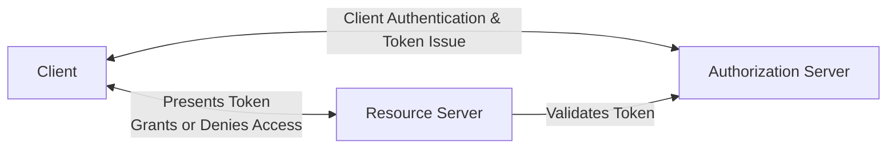
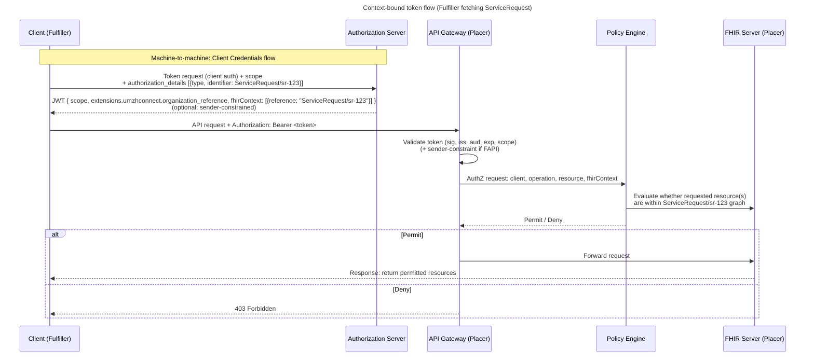
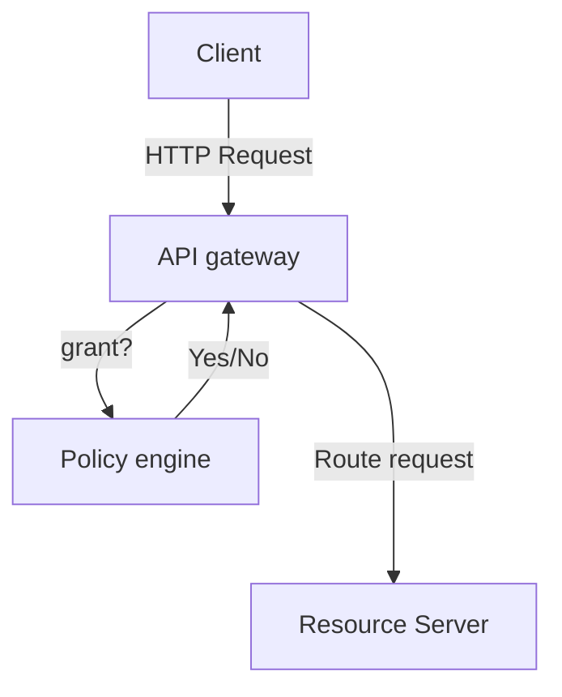

<style>
div.mermaid iframe {
  width: 100% !important;
  height: 150px !important;
  border: 0 !important;
}
.mermaid-tall div.mermaid iframe {
  height: 480px !important;
}
.mermaid-middle div.mermaid iframe {
  height: 350px !important;
}
</style>

In this article:

- [Introduction](#introduction)
- [General approach - OAuth](#general-approach---oauth)
- [Health specifics - SMARTonFHIR](#health-specifics---smartonfhir)
- [Context-centric authorization](#context-centric-authorization)
- [Authorization enforcement](#authorization-enforcement)
- [Client authentication](#client-authentication)
- [Relationship to other security profiles](#relationship-to-other-security-profiles)


### Introduction

This page defines the security, authorization, and trust model for the UMZH-Connect API ecosystem: how each participant secures its FHIR APIs so data can be exchanged through open but controlled interfaces, using established industry standards. The model is designed to scale as the ecosystem grows in participants, software vendors, and regulatory expectations.

The reference use case: a placer creates a Task at the fulfiller that references a ServiceRequest on the placer’s side; the fulfiller fetches that ServiceRequest and then queries and fetches the further resources it references.

OAuth 2.0 and OpenID Connect are today’s de-facto standard for securing APIs; SMART on FHIR profiles them for health-specific use cases, and the OpenID Foundation’s FAPI 2.0 adds hardening for higher-risk scenarios. UMZH-Connect builds directly on these standards and adds only the measures its workflow-bound use cases require.

The focus is machine-to-machine interaction, central to referral and order workflows. Client authentication uses `private_key_jwt` as the baseline (see [Client authentication](#client-authentication)), with a staged path from shared secrets (pilots) to mTLS (high assurance) described in the [Implementation Notes](guidance-implementation-notes.html#staged-client-authentication-model). The model is intended to extend in future to user- and human-centric authentication — in particular the Swiss E-ID initiative for identifying registered users — which is out of scope for this page.

### General approach - OAuth

Today's de-facto standard for securing Web-APIs is **OAuth & OpenID Connect**. In general OAuth is quite loosely defined and allows various ways of implementation. On a very high-level you could think of it like the following:

> *An application (possibly in combination with a logged in user) would like to access data from an external service. It therefore requests a security token from an authorization authority by providing credentials and uses this token in the request to the data service to provide proof of access rights and hence being allowed to access the data.*

**We follow industry standards with the use of OAuth/OIDC to segregate duties between identity management, token issuance, authentication & authorization enforcement.**

**OAuth glossary**

**Authorization Server (AS) -** The system that issues tokens after validating identity, credentials, or policies.<br />
**Resource Server (RS) -** The API or service that receives and validates tokens before granting access.<br />
**Client -** The application requesting access on behalf of a user or system.<br />
**Access Token -** A short‑lived credential the client uses to call APIs.<br />
**Scopes -** Fine‑grained permissions describing what the client is allowed to access.<br />
**Claims -** Attributes embedded in a token (e.g., user ID, roles, tenant, expiry).<br />
**Client Authentication -** How a client proves its identity to the authorization server (e.g., client secret, mTLS, private key JWT).<br />
**Grant Type -** The method a client uses to obtain tokens (e.g., Authorization Code, Client Credentials).<br />
**Policy engine** - system that evaluates rules (“policies”) to decide whether a specific action is allowed.<br />


```mermaid
flowchart LR
    Client <-->|Client Authentication & Token Issue| AS[Authorization Server]
    Client <-->|Presents Token<br>Grants or Denies Access| RS[Resource Server]
    RS -->|Validates Token| AS
```

**Machine-To-Machine communication**

Our principal focus will be on machine-to-machine communication: an organization allowing access to a set of data records to another organization without knowing which person is actually sending the request. It is likely that in later scenarios this option should also be considered and can be achieved by using alternative OAuth flows.

The **client-credentials OAuth flow** is the common way to approach this: the client presents its credentials and the scopes describing the action it is about to perform to the **authorization server**, and in exchange receives an **access token.**

The access token again the client injects in the request to the **resource server** (the organization holding the sensitive patient data) and the latter can validate the token and grant or deny access.

### Health specifics - SMARTonFHIR

SMART on FHIR defines a **standard way for apps to securely connect to healthcare data** by combining:

- **OAuth 2.0–based authorization**
- **FHIR as the data API**
- **A consistent launch protocol** for apps inside or outside an EHR
- **A unified way to request permissions** using SMART scopes (i.e. **system/Patient.r** - read patient data etc..)

In practice, it gives app developers a predictable, interoperable method to authenticate, obtain tokens, and read/write clinical data across different EHR systems without custom integrations.

In our particular case we use SMART in the context of our use cases, for example:

- Ask permission to create a task resource at party X - scope: system/Task.w
- Ask permission to read service request data from party Y - scope: system/ServiceRequest.rs

### Context-centric authorization

Our use-cases of referrals and external service requests strongly suggest to dynamically authorize the audience (the counter party) to a very limited data set. Think of establishing a context when the service request is created:

> *For a given time I authorize party X (represented by client X) to read all data referenced by my given service request.*

Rather than minting a separate consent record and communicating its identifier through the authorization flow, UMZH-Connect binds the access token directly to the workflow object that triggered the interaction. Each cross-organizational API request is executed in the context of a specific FHIR resource. This context determines which resources the requester is permitted to access — all resources reachable (forward-referenced) from the workflow root in the FHIR reference graph:

{:class="table table-bordered"}
| Direction | Initiator | Context resource |
|-----------|-----------|-----------------|
| Fulfiller → Placer | Fulfiller fetches ServiceRequest and its forward-referenced resources | **ServiceRequest ID** (on Placer’s FHIR server) |
| Placer → Fulfiller | Placer reads Task status and forward-referenced output resources | **Task ID** (on Fulfiller’s FHIR server) |

Context as part of the authorization flow may logically not be necessary — the restricting party may check all its workflow objects and verify whether one matches the current API request. However, defining the context identification as part of the authorization flow and access token may significantly simplify the authorization enforcement. The API consumer in essence tells the API provider in which **context** the API request is executed.

#### Communicating context at the token endpoint

The client communicates the workflow context to the Authorization Server using the **`authorization_details`** parameter defined in [RFC 9396 (Rich Authorization Requests)](https://www.rfc-editor.org/rfc/rfc9396). This is the standard OAuth extension point for structured, instance-specific authorization requests — purpose-built for cases where resource-type scopes alone are insufficient.

> **Note:** `authorization_details` is the same extension point used by [OpenID for Verifiable Credential Issuance (OID4VCI)](https://openid.net/specs/openid-4-verifiable-credential-issuance-1_0.html) to carry credential requests (`type: "openid_credential"`). UMZH-Connect follows the identical pattern with a custom type (`"umzh-connect-context"`), making the approach consistent with emerging identity standards and leveraging the same AS infrastructure — for example Keycloak's RAR support — that OID4VCI relies on.

The `scope` parameter continues to carry the SMART resource-type permission; `authorization_details` carries the instance-level context. The `type` URI identifies this as a UMZH-Connect extension; `identifier` follows RFC 9396 semantics — a plain string identifying a specific resource at the API:

```http
POST /token HTTP/1.1
Host: auth.umzhconnect.ch
Content-Type: application/x-www-form-urlencoded

grant_type=client_credentials
&client_id=fulfiller-app
&client_assertion_type=urn:ietf:params:oauth:client-assertion-type:jwt-bearer
&client_assertion=<signed JWT>
&scope=system/ServiceRequest.rs system/Patient.r system/Condition.r
&authorization_details=[{
  "type": "umzh-connect-context",
  "identifier": "ServiceRequest/sr-123"
}]
```

The `<signed JWT>` placeholder above is the **client-authentication assertion** ([RFC 7523](https://datatracker.ietf.org/doc/html/rfc7523)), as profiled by [SMART App Launch — Authenticating to the token endpoint](https://hl7.org/fhir/smart-app-launch/STU2.2/client-confidential-asymmetric.html#authenticating-to-the-token-endpoint) and inherited by [SMART Backend Services](https://hl7.org/fhir/smart-app-launch/backend-services.html#protocol-details) — the client constructs it itself and signs it with the private key whose public counterpart (its JWKS) was registered with the Authorization Server at onboarding. It is short-lived, single-use, and pins the request to one specific token endpoint:

```json
{
  "iss": "fulfiller-app",              // client_id as registered at the AS (RFC 7523)
  "sub": "fulfiller-app",              // same as iss for client-credential assertions (RFC 7523)
  "aud": "https://auth.umzhconnect.ch/token",  // AS token endpoint URI — pins assertion to this endpoint (RFC 7523)
  "exp": 1716470500,                   // short-lived; absolute Unix timestamp (RFC 7523; ≤ 5 min per SMART)
  "jti": "9f4c-unique-nonce"           // unique per request; AS MUST reject reuse — replay guard (SMART Backend Services)
}
```

The Authorization Server validates this assertion (signature against the registered JWKS, `aud` equals its token endpoint, `exp` not expired, `jti` not previously seen) before proceeding to issue the access token described below. Note that this assertion JWT is distinct from the access token: the **client** signs the assertion to prove its identity to the AS; the **AS** signs the access token for the Resource Server to consume.

#### Issued access token — `fhirContext` and organization claims

The Authorization Server maps the `authorization_details` context into a `fhirContext` claim in the issued JWT access token. The `fhirContext` structure follows [SMART App Launch v2](https://hl7.org/fhir/smart-app-launch/scopes-and-launch-context.html#fhircontext-exp). Note that SMART defines `fhirContext` only as a token-response parameter; UMZH-Connect extends that usage by additionally carrying the same structure as a claim inside the JWT access token, so that resource servers can enforce context without an extra introspection call.

The issued token also carries an organization identity claim inside the `extensions` object, following the [IHE IUA](https://profiles.ihe.net/ITI/IUA/index.html)-defined container for custom JWT claims — the same approach [CH EPR ITI-71](https://www.fhir.ch/ig/ch-epr-fhir/iti-71.html) uses in its issued access token. UMZH-Connect uses `umzhconnect` as its extension key:

- **`extensions.umzhconnect.organization_reference`** — the resolvable registry URL of the calling organization's `Organization` resource (e.g. `https://registry.umzhconnect.ch/fhir/Organization/fulfiller-org`). This value matches `Task.owner.reference` and `Task.requester.reference` in workflow resources, enabling direct string comparison at the Resource Server without a live registry lookup.

**`extensions.umzhconnect.organization_reference` is authoritative because the AS owns the mapping.** During onboarding, each `client_id` is bound to an Organization record in the AS. That record must carry at minimum `organization_reference` — the canonical URL of the corresponding `Organization` resource in the UMZH-Connect registry. Additional properties (e.g. a GLN-based stable identifier) may be recorded and surfaced as further claims in a later iteration. The AS embeds `extensions.umzhconnect.organization_reference` from this onboarding record at token issuance; the client cannot supply or override it. Multiple clients from the same organization share the same Organization record and therefore yield the same `organization_reference`.

```json
{
  "iss": "https://auth.umzhconnect.ch",
  "sub": "fulfiller-app",
  "aud": "https://fhir.placer.example",
  "exp": 1234567890,
  "scope": "system/ServiceRequest.rs system/Patient.r system/Condition.r",
  "extensions": {
    "umzhconnect": {
      "organization_reference": "https://registry.example.org/fhir/Organization/fulfiller-org"
    }
  },
  "fhirContext": [
    {
      "reference": "ServiceRequest/sr-123"
    }
  ]
}
```

Below is an example of the full token-request and resource-access sequence:

<div class="mermaid-tall" markdown="1">


```mermaid
sequenceDiagram
  title Context-bound token flow (Fulfiller fetching ServiceRequest)

  participant C as Client (Fulfiller)
  participant AS as Authorization Server
  participant AG as API Gateway (Placer)
  participant PE as Policy Engine
  participant FHIR as FHIR Server (Placer)

  Note over C,AS: Machine-to-machine: Client Credentials flow
  C->>AS: Token request (client auth) + scope<br/>+ authorization_details [{type, identifier: ServiceRequest/sr-123}]
  AS-->>C: JWT { scope, extensions.umzhconnect.organization_reference, fhirContext: [{reference: "ServiceRequest/sr-123"}] }<br/>(optional: sender-constrained)

  C->>AG: API request + Authorization: Bearer <token>
  AG->>AG: Validate token (sig, iss, aud, exp, scope)<br/>(+ sender-constraint if FAPI)
  AG->>PE: AuthZ request: client, operation, resource, fhirContext
  PE->>FHIR: Evaluate whether requested resource(s)<br/>are within ServiceRequest/sr-123 graph
  PE-->>AG: Permit / Deny
  alt Permit
    AG->>FHIR: Forward request
    FHIR-->>C: Response: return permitted resources
  else Deny
    AG-->>C: 403 Forbidden
  end
```

</div>

How a party enforces this context internally — for example by maintaining a local FHIR Consent resource keyed to the workflow object — is a local implementation concern, described in [Implementation Notes](guidance-implementation-notes.html#consent-based-context-enforcement).

### Authorization enforcement

An enterprise grade web-service architecture, involves a number of steps for processing an HTTP request - DMZ / Firewall, TLS (HTTPS) termination, authentication, request routing, request processing and fine-grained authorization on resource server,

<div class="mermaid-middle" markdown="1">


```mermaid
flowchart TB
    Client -->|HTTP Request| API
    API -->|grant?| PE[Policy engine]
    PE -->|Yes/No| API
    API[API gateway] --->|Route request| RS[Resource Server]
```

</div>

We can think of a 3 step process to enforce security:

- Authentication - token extraction and validation -> we know the identity
- Scope Authorization - ensure that scope parameters match the requested parameters
- Context enforcement & fine-grained authorization, comprising two distinct checks:
  - **Counter-party entitlement** — is the calling party allowed to invoke this workflow context at all?
  - **Graph membership** — is each requested resource reachable from the workflow context root?

A common approach would be to handle the first (and optionally the second) step in the API gateway and the second and third step by the policy engine. In our case it would mean to ensure that all requested resources are part of the 'child graph' of the service request, which is the authorized workflow context (the `fhirContext` reference from the access token).

#### Counter-party entitlement is a Resource Server obligation

The `authorization_details` parameter is a **client-asserted** statement of context. The Authorization Server validates client authentication and scope syntax, but it does not by itself prove that the calling party is the legitimate counter-party of the workflow object named in the request — that knowledge lives in the Resource Server's workflow state, not at the AS. Requiring the AS to consult cross-organizational workflow data on every token request would force a tight AS↔RS coupling that the staged trust model of this guide deliberately avoids.

UMZH-Connect therefore places the counter-party entitlement check **on the Resource Server's policy engine**, alongside the graph-walk. For every incoming request the RS MUST:

1. Validate the token (signature, issuer, audience, expiry, and sender-constraint where applicable).
2. Verify that `extensions.umzhconnect.organization_reference` is the legitimate counter-party named by the workflow object referenced in the token's `fhirContext` — for example, that `extensions.umzhconnect.organization_reference` matches `Task.owner.reference` for a fulfiller fetching a ServiceRequest, or `Task.requester.reference` for a placer reading Task status. This is a direct string comparison: the AS embeds the registry URL at token issuance from the onboarding record, so no live registry lookup is required.
3. Verify that every requested resource is reachable from `fhirContext` in the FHIR reference graph.

Tokens whose `fhirContext` resolves to a workflow object that does not name the calling party MUST be rejected with `403 Forbidden`, regardless of whether the AS issued a syntactically valid token for that context. The AS issues context-bound assertions; the Resource Server remains the sole arbiter of whether a given party is entitled to act within that context. How this check is realized internally — e.g. by inspecting the workflow object directly or via a local `Consent` resource keyed to it — is a local implementation concern, described in [Security Implementation](security-implementation.html#consent-based-context-enforcement).

In general it should be mentioned that fine-grained authorization may be a very complex task to perform on the standard FHIR API due to a variety of factors, such as a broad range of search parameters covered by standard FHIR APIs. This is quite well covered in the [Google FHIR Info Gateway](https://developers.google.com/open-health-stack/fhir-info-gateway) project.

Our general approach is to whitelist only the neccessary endpoints and parameters required to enable our use case. The complexity of the authorization enforcement is therefore essentially reduced.

### Client authentication

UMZH-Connect authenticates clients to the token endpoint with **`private_key_jwt`**: each client generates its own key pair and registers the **public key / JWKS** with the Authorization Server at onboarding, then signs the client-authentication assertion (shown above) with the matching private key. No shared secrets are exchanged, and key rotation is handled by updating the registered JWKS.

This aligns UMZH-Connect with **[SMART App Launch v2 — Backend Services](https://hl7.org/fhir/smart-app-launch/backend-services.html)**: clients authenticate to the token endpoint with `private_key_jwt` against a JWKS registered at onboarding, and SMART system scopes (`system/<Resource>.<perms>`) are carried in the standard `scope` parameter — not in a custom claim. No `openid` scope is requested, since these are pure machine-to-machine exchanges with no user identity. The single deliberate divergence from Backend Services is the per-request **`fhirContext` claim** embedded in the issued JWT access token (see [Context-centric authorization](#context-centric-authorization)), which binds each token to a specific workflow object. SMART defines `fhirContext` only as a token-response parameter; promoting it into the access token is what makes context enforceable at the Resource Server without an extra introspection call.

> The client-authentication *method* is the one part of this profile expected to vary by deployment risk — pilots may begin with a simpler shared-secret rung, and high-assurance deployments may add mutual TLS (mTLS) with [FAPI 2.0](https://openid.net/specs/fapi-security-profile-2_0-final.html) hardening — while the **authorization model and APIs stay identical**. The full staged ladder, the governance triggers for moving between rungs, and the FAPI 2.0 discussion are described in [Implementation Notes — Staged client-authentication model](guidance-implementation-notes.html#staged-client-authentication-model).

### Relationship to other security profiles

This section positions the UMZH-Connect security concept against three reference profiles that target overlapping problem spaces. The single architectural choice that distinguishes UMZH-Connect from all three is **context-bound tokens**: every access token is issued for one specific workflow object (a `ServiceRequest` or `Task`) carried in the JWT as a `fhirContext` claim, derived from an [RFC 9396](https://www.rfc-editor.org/rfc/rfc9396) `authorization_details` request. None of the reference profiles standardize this per-request binding.

**References:**

- [SMART App Launch v2 — Backend Services](https://hl7.org/fhir/smart-app-launch/backend-services.html)
- [HL7 FAST UDAP Security for Scalable Registration, Authentication, and Authorization](https://hl7.org/fhir/us/udap-security/)
- [CH EPR FHIR — Get Access Token [ITI-71]](https://www.fhir.ch/ig/ch-epr-fhir/iti-71.html), the Swiss national profile of the [IHE IUA](https://profiles.ihe.net/ITI/IUA/index.html) Get Access Token transaction.

{:class="table table-bordered"}
| Aspect | UMZH-Connect | [SMART Backend Services v2](https://hl7.org/fhir/smart-app-launch/backend-services.html) | [HL7 FAST UDAP](https://hl7.org/fhir/us/udap-security/) | [CH EPR ITI-71 (IUA)](https://www.fhir.ch/ig/ch-epr-fhir/iti-71.html) |
|---|---|---|---|---|
| Primary scope | M2M, per-workflow context | M2M, pre-authorized scopes | M2M + user via Tiered OAuth | M2M + healthcare professional / assistant |
| Trust onboarding | Bilateral JWKS at onboarding; mTLS w/ open CA for high assurance | Out-of-band pre-registration | UDAP Dynamic Client Reg + community X.509 CA | Per-CH-EPR policy; registered actors |
| Client auth | `private_key_jwt` (JWKS at onboarding); mTLS option for high assurance | `private_key_jwt` mandatory | `private_key_jwt` w/ UDAP cert; mTLS option | `private_key_jwt` + HTTP Message Signatures ([RFC 9421](https://datatracker.ietf.org/doc/html/rfc9421)) |
| Scope vocabulary | SMART `system/*` in `scope` | SMART `system/*` in `scope` | SMART-compatible + UDAP extensions | Profile-specific (`launch`, EPR scopes) |
| Per-request workflow context | **[RFC 9396](https://www.rfc-editor.org/rfc/rfc9396) + `fhirContext` JWT claim** | Not addressed | Not addressed | Not addressed |
| Caller-organization identity | `extensions.umzhconnect.organization_reference` (registry URL) — follows [IHE IUA](https://profiles.ihe.net/ITI/IUA/index.html) `extensions` container pattern | Not standardized | UDAP B2B `hl7-b2b` extension (`organization_id`, `organization_name`, `purpose_of_use`) | `extensions.ihe_iua` + `extensions.ch_epr` |
| User identity in M2M | Not in scope | Out-of-band for `user/`/`patient/` | Tiered OAuth → user's OIDC IdP | Mandatory `subject_name`, `subject_role`, `purpose_of_use` |
| Token format | JWT | JWT | JWT | JWT only (JWE forbidden) |
| Hardening reference | [FAPI 2.0](https://openid.net/specs/fapi-security-profile-2_0-final.html) (high-assurance option) | OAuth 2.0 BCP | UDAP profiles + cert policies | OAuth 2.1 + [RFC 9421](https://datatracker.ietf.org/doc/html/rfc9421) |
