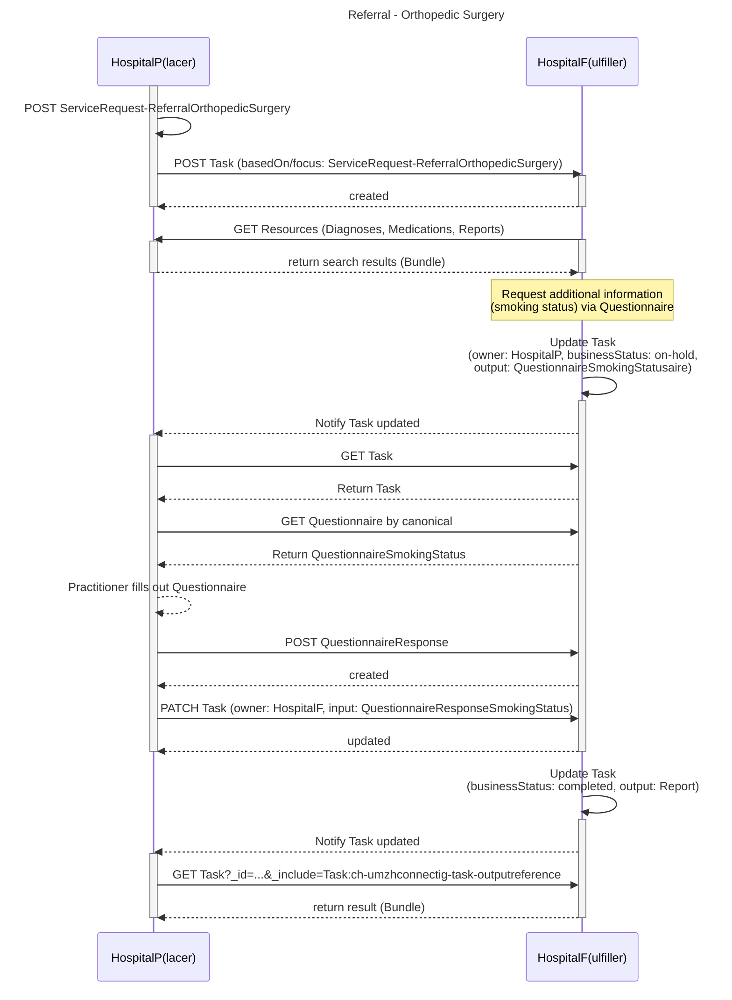

### Referral - Orthopedic Surgery

The patient [PetraMeier](Patient-PetraMeier.html) visits the emergency department of HospitalP(lacer) with knee pain after falling on icy street. The [treating practitioner](PractitionerRole-HansMusterRole.html) suspects a rupture of the left ACL and suggests treatment at HospitalF(ulfiller).
Comorbidities: The patient is already being treated for heart problems in cardiology at HospitalP.

[Example ServiceRequest](ServiceRequest-ReferralOrthopedicSurgery.html)

[Example Task (Initial - Referral Orthopedic Surgery)](Task-TaskReferralOrthopedicSurgery.html)

[Example Task (Updated - with Questionnaire)](Task-TaskReferralOrthopedicSurgeryUpdated.html)

[Example Questionnaire (Smoking Status)](Questionnaire-QuestionnaireSmokingStatus.html)

[Example QuestionnaireResponse (Smoking Status)](QuestionnaireResponse-QuestionnaireResponseSmokingStatus.html)

#### Overview

#### Field Sources

The following table indicates the source of each field in the ServiceRequest:

| Field | Source | Description |
|-------|--------|-------------|
| `identifier[placerOrderIdentifier].system` | Hard-coded | TODO? |
| `identifier[placerOrderIdentifier].value` | Generated | Unique referral order number (e.g., REF-2025-001) |
| `status` | Hard-coded | Fixed value `active` |
| `intent` | Hard-coded | Fixed value `order` |
| `category` | [VS CH UMZH Connect ServiceRequest Category](ValueSet-ch-umzh-connect-servicerequest-category.html) | SNOMED CT code 183545006 "Referral to orthopedic service (procedure)" |
| `subject` | Referenced | the patient being referred |
| `requester` | Referenced | the referring physician with their organizational context |
| `authoredOn` | Current date | Date when the referral was created |
| `reasonReference` | Referenced | Primary diagnosis: [Suspected ACL Rupture](Condition-SuspectedACLRupture.html). If the primary diagnosis is unknown, all diagnoses go to supportingInfo as Condition. The title of the diagnosis is captured in `Condition.code.text` whereas any additional description in `Condition.note.text`. |
| `supportingInfo` | Referenced | Secondary diagnosis: [Heart Failure HFrEF](Condition-HeartFailureHFrEF.html); Medications: [Entresto](MedicationStatement-MedicationEntresto.html), [Concor](MedicationStatement-MedicationConcor.html); Documents: [Report Cardiology](DocumentReference-DocCardiologyAttachment.html) |
| `note.text` | Manual entry | Free-text clinical note entered ad-hoc for the referral |

#### Task Field Sources

The following table indicates the source of each field in the Task:

| Field | Source | Description |
|-------|--------|-------------|
| `status` | Dynamic | Initial Task: `ready` (created by Placer). Updated Task: `in-progress` (after Fulfiller accepts and updates) |
| `intent` | Hard-coded | Fixed value `order` |
| `priority` | Hard-coded | Fixed value `routine` |
| `basedOn` | Referenced | The [ServiceRequest](ServiceRequest-ReferralOrthopedicSurgery.html) this Task is based on |
| `for` | Referenced | The patient being referred: [PetraMeier](Patient-PetraMeier.html) |
| `requester` | Referenced | The referring physician with their organizational context: [HansMusterRole](PractitionerRole-HansMusterRole.html) |
| `owner` | Dynamic | Initial Task: HospitalF (Fulfiller). When Fulfiller creates Questionnaire: changed to HospitalP (Placer). When QuestionnaireResponse is created: changed back to HospitalF (Fulfiller). The organization responsible for fulfilling the task |
| `businessStatus` | Dynamic | Initial Task: `ready`. When Fulfiller creates Questionnaire: changed to `on-hold`. When QuestionnaireResponse is created: changed to `in-progress` |
| `authoredOn` | Current date | Date when the Task was created by the Placer |
| `lastModified` | Current date | Date when the Task was last updated (only in updated Task) |
| `focus` | Referenced | The [ServiceRequest](ServiceRequest-ReferralOrthopedicSurgery.html) this Task focuses on |
| `input[0].type` | Hard-coded | `273510007` (only when Questionnaire is created) |
| `input[0].valueCanonical` | Referenced | Reference to the canonical [Questionnaire](Questionnaire-QuestionnaireSmokingStatus.html) to be completed (only when Questionnaire is created) |
| `output[0].type` | Hard-coded | `273510007` (only when QuestionnaireResponse is created) |
| `output[0].valueReference` | Referenced | Reference to the [QuestionnaireResponse](QuestionnaireResponse-QuestionnaireResponseSmokingStatus.html) (only when QuestionnaireResponse is created) |

