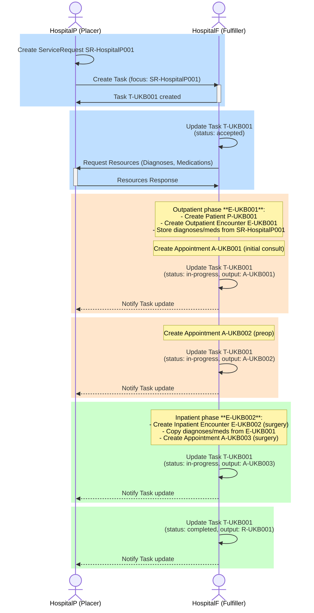

### Referral - Orthopedic Surgery

The patient [PetraMeier](Patient-PetraMeier.html) visits the emergency department of HospitalP(lacer) with knee pain after falling on icy street. The [treating practitioner](PractitionerRole-HansMusterRole.html) suspects a rupture of the left ACL and suggests treatment at HospitalF(ulfiller).
Comorbidities: The patient is already being treated for heart problems in cardiology at HospitalP.

[Example ServiceRequest](ServiceRequest-ReferralOrthopedicSurgery.html)

#### Overview

#### Field Sources

The following table indicates the source of each field in the ServiceRequest:

| Field | Source | Description |
|-------|--------|-------------|
| `identifier[placerOrderIdentifier].system` | Hard-coded | TODO? |
| `identifier[placerOrderIdentifier].value` | Generated | Unique referral order number (e.g., REF-2025-001) |
| `status` | Hard-coded | Fixed value `active` |
| `intent` | Hard-coded | Fixed value `order` |
| `category` | Hard-coded | SNOMED CT code 306206005 "Referral to service" |
| `subject` | Referenced | the patient being referred |
| `requester` | Referenced | the referring physician with their organizational context |
| `authoredOn` | Current date | Date when the referral was created |
| `reasonReference` | Referenced | Primary diagnosis: [Suspected ACL Rupture](Condition-SuspectedACLRupture.html). If the primary diagnosis is unknown, all diagnoses go to supportingInfo as Condition. |
| `supportingInfo` | Referenced | Secondary diagnosis: [Heart Failure HFrEF](Condition-HeartFailureHFrEF.html); Medications: [Entresto](MedicationStatement-MedicationEntresto.html), [Concor](MedicationStatement-MedicationConcor.html) |
| `note.text` | Manual entry | Free-text clinical note entered ad-hoc for the referral |

