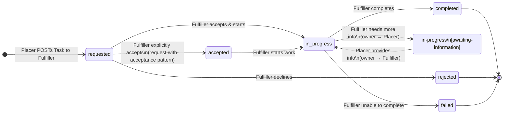

### Task Workflow States

The `CoordinationTask` lifecycle is governed by two complementary fields:

- **`Task.status`** — the FHIR base state machine ([Task state machine](https://hl7.org/fhir/task.html#statemachine)); reflects the overall lifecycle of the task
- **`Task.businessStatus`** — a domain-specific qualifier that sits *alongside* `Task.status` to convey sub-states meaningful to the workflow; codes are drawn from [COW business status codes](https://hl7.org/fhir/uv/cow/2025May/ValueSet-business-status.html)

This IG follows the [COW Workflow State Overview](https://hl7.org/fhir/uv/cow/2025May/workflow-state-overview.html) with the constraints documented below. Note that COW's `received` state is intentionally omitted in this version of the IG: a Task transitions directly from `requested` to `accepted` or `in-progress`.

**Rules:**

- Only the Fulfiller may change `Task.status` — it is not patchable by the Placer (see [Core Concepts](core-concepts.html))
- The Placer may only PATCH the Task when `Task.owner` references the Placer organization
- The Placer may only PATCH the fields: `owner`, `businessStatus`, `input`, and `focus`
- `Task.businessStatus` must only contain domain-specific workflow codes; `Task.status` codes must never be used as `businessStatus` values
- Cancellation by the Placer is not foreseen in this version of the IG

### State Diagram

### State Transition Table

{:class="table table-bordered"}
| State label | `Task.status` | `Task.businessStatus` | `Task.owner` | Who sets this | Notes |
|---|---|---|---|---|---|
| Requested | `requested` | — | Fulfiller org | Placer | Initial state when Task is POSTed to Fulfiller |
| Accepted | `accepted` | — | Fulfiller org | Fulfiller | Explicit acceptance; may be skipped in pre-agreed flows |
| In progress | `in-progress` | — | Fulfiller org | Fulfiller | Fulfiller has started work |
| Awaiting information | `in-progress` | `awaiting-information` | Placer org | Fulfiller | Fulfiller has added Questionnaire to `Task.output`; owner shifted to Placer |
| Information received | `in-progress` | — | Fulfiller org | Placer | Placer has PATCHed Task with QuestionnaireResponse in `Task.input`, cleared `businessStatus`, and shifted owner back to Fulfiller |
| Completed | `completed` | — | Fulfiller org | Fulfiller | Results referenced in `Task.output` |
| Rejected | `rejected` | — | — | Fulfiller | Fulfiller declines; Placer may approach another Fulfiller |
| Failed | `failed` | — | — | Fulfiller | Fulfiller accepted but could not complete |
